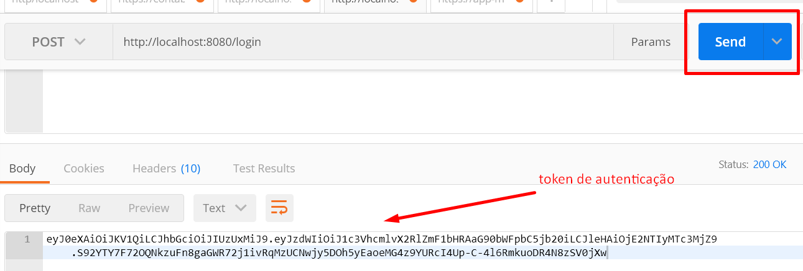
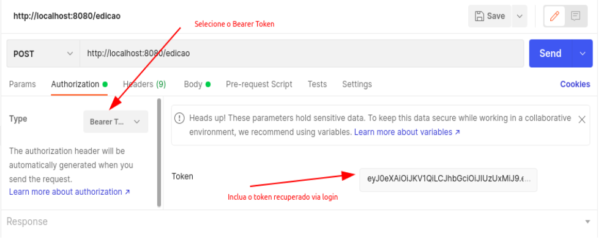

# MAGIC THE GATHERING API v1.0

# Arquitetura
Sistema foi implementado utilizando o framework SPRING junto ao Banco de dados POSTGRES , 
a arquitetura escolhida para criar o projeto foi a arquitetura hexagonal, 
onde todas as regras de negocio encontram-se na pasta core, de modo que as demais pastas não afetem quaisquer alterações negociais.

# Como iniciar o projeto
O projeto possui um DockerFile com todas as configurações nescessarias para que o projeto seja iniciado, na pasta raiz podemos
encontrar um arquivo de docker-compose, de modo que para subir nossa aplicação basta rodar o seguinte comando no terminal:

````shell
docker-compose up
````

# Como usar o sistema

O sistema possui metodo de autenticação JWT e OAUTH2, de modo que para poder acessar a aplicação é 
nescessario cadastrar um novo usuario, para realizar o cadastro basta realizar uma requisicao http POST


END POINT DE CADASTRO
````
  http://localhost:8080/usuario
`````

PAYLOAD DE CADASTRO
````
    {
        "login":{STRING | EMAIL},
        "password":{STRING}
    }
````

Após ter um usuario cadastrado basta realizar o login no sistema

END POINT DE LOGIN
````
  http://localhost:8080/login
`````

PAYLOAD DE LOGIN
````
    {
        "login":{STRING},
        "password":{STRING}
    }
````

Apos realizar o login o sistema retornara um token de autenticação de modo que seja possivel utilizar,
os demais recursos do sistema



# COMO INCLUIR O TOKEN DE AUTENTICAÇÃO


# INCLUINDO UMA EDIÇÃO AO SISTEMA VERBO HTTP POST

para incluir uma nova edição ao sistema basta disparar um endpoint usando o verbo http POST

ENDPOINT
````
http://localhost:8080/edicao
````

PAYLOAD
````
    {
       "nome": {STRING},
       "ano": {INTEGER},
       "siglaEdicao": {STRING}
    }
````

# BUSCANDO UMA EDICAO VIA SIGLA VERBO HTTP GET

ENDPOINT
````
http://localhost:8080/edicao/sigla/{STRING}
````

# BUSCANDO UMA EDICAO VIA ID VERBO  HTTP GET

ENDPOINT
````
http://localhost:8080/edicao/id/{LONG}
````

# INCLUINDO UMA CARTA AO SISTEMA VERBO HTTP POST

ENDPOINT
````
http://localhost:8080/carta
````

PAYLOAD
````
   {
       "nome":{STRING}",
       "siglaEdicao":{PORTUGUES, INGLES, JAPONES},
       "idioma": {STRING},
       "foil": {BOOLEAN},
       "valor": {BIGDECIMAL},
       "quantidadeDeCartas": {INTEGER}
   }
````

# ATUALIZANDO UMA CARTA AO SISTEMA VERBO HTTP PUT
[Só é possivel atualizar as cartas pertecentes ao usuario logado]

ENDPOINT CARTA

````
http://localhost:8080/carta
````

PAYLOAD
````
   {
       "nome":{STRING}",
       "siglaEdicao":{PORTUGUES, INGLES, JAPONES},
       "idioma": {STRING},
       "foil": {BOOLEAN},
       "valor": {BIGDECIMAL},
       "quantidadeDeCartas": {INTEGER}
   }
````

# REMOVENDO UMA CARTA VERBO HTTP DELETE
[Só é possivel remover as cartas pertecentes ao usuario logado]

ENDPOINT CARTA

````
http://localhost:8080/carta/id/{LONG}
````

# RECUPERANDO TODAS AS CARTAS VERBO HTTP GET

retornar todas as cartas de todos os usuarios

é possivel passar os seguintes filtros na pesquisa

o tamanho da pagina com o parametro = ``pageSize``

a pagina com o parametro = ``pageNo``

a ordenacao com o parametro = ``ordemType`` valores aceitos [ASC, DESC]

e o filtro com o parametro = ``sortBy`` valores aceitos [TODOS OS VALORES DENTRO DO PAYLOAD DE CARTA]

``Não é obrigatorio passar estes parametros``

END POINT

````
http://localhost:8080/carta?pageSize=1&pageNo=0&ordemType=ASC&sortBy=nome
````

# RECUPERANDO TODAS AS CARTAS DO USUARIO LOGADO VERBO HTTP GET

os parametros são os mesmo que recuperar todas as cartas

````
 http://localhost:8080/carta/minhas-cartas?pageSize=1&pageNo=0&ordemType=ASC&sortBy=nome
````

# RECUPERANDO APENAS UMA CARTA VERBO HTTP GET

````
 http://localhost:8080/carta/id/{LONG}
````